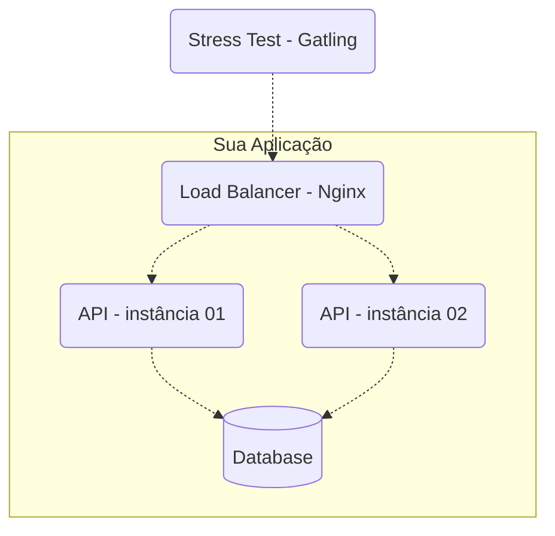

# rinha

Projeto baseado no desafio da [rinha de backend](https://github.com/zanfranceschi/rinha-de-backend-2023-q3)

## Rodando projeto

1. instalar dependências:

```bash
bun install
```

2. copiar o arquivo `.env.example` como `.env` e atualizar os valores se necessário

3. run:

```bash
bun run src/index.js
```

## Objetivo

Montar um crud de `pessoas`, uma aplicação web que receba as seguintes requisições:

#### Criar pessoa

- `POST /pessoas`
  ```json
  Request Body
  {
    "apelido": "josé",
    "nome": "José Roberto",
    "nascimento": "2000-10-01",
    "stack": ["C#", "Node", "Oracle"]
  }
  ```
  Success response status: 201
  Response header `Location: /pessoas/:id`

<details>
  <summary>Requisitos</summary>

- Resposta:
  - Para requisições válidas, a API deve retornar 201 junto com header 'Location: /pessoas/:id' onde ':id' é o id (UUID) da pessoa que acabou de ser criada, sem necessidade de conteúdo da resposta;
  - Para requisições inválidas, o status deve ser 422, sem necessidade de conteúdo da resposta;
- Requisições inválidas:
  - `apelido`:
    - não pode ser `null` (422)
    - deve ser único (422)
  - `nome`:
    - não pode ser `null` (422)
    - deve ser string (400)
  - `stack`:
    - deve ser string array

</details>

### Exibir pessoa

- `GET /pessoas/[:id]`
  ```json
  Response Body
  {
    "id": "f7379ae8-8f9b-4cd5-8221-51efe19e721b",
    "apelido": "josé",
    "nome": "José Roberto",
    "nascimento": "2000-10-01",
    "stack": ["C#", "Node", "Oracle"]
  }
  ```

### Pesquisar pessoas

- `GET /pessoas?t=[:termo-de-busca]`
  ```json
  Response Body
  [
    {
      "id": "f7379ae8-8f9b-4cd5-8221-51efe19e721b",
      "apelido": "josé",
      "nome": "José Roberto",
      "nascimento": "2000-10-01",
      "stack": ["C#", "Node", "Oracle"]
    },
    {
      "id": "5ce4668c-4710-4cfb-ae5f-38988d6d49cb",
      "apelido": "ana",
      "nome": "Ana Barbosa",
      "nascimento": "1985-09-23",
      "stack": ["Node", "Postgres"]
    }
  ]
  ```

### Contagem pessoas

- `GET /contagem-pessoas`
  Response Body
  ```json
  23
  ```

## Ambiente de testes

A aplicação deve ser hospedada através do docker-compose, contendo uma instância nginx para load-balancer, 2 instancias da aplicação e o banco de dados postgres.


